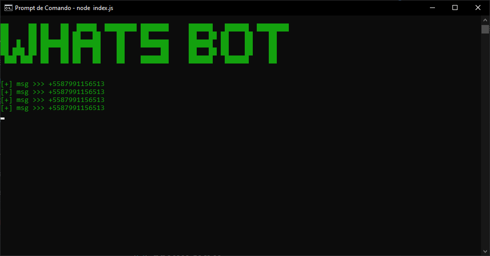

<h1 align=center>🤖WhatsBot</h1>

<h3 align=center>Bot para WhatsApp</h3>

WhatsBot é um script que automatiza o navegador/browser usando puppeteer para o envio de mensagems no whatsapp de forma automatica. 

<div align=center>

</div>

## Instalação:
### 💻 Derivados do Debian:

```
git clone https://github.com/CarlosAllberto/WhatsBot
cd WhatsBot
sudo apt install node npm -y
npm install
node index.js
```

Em uma linha:

```
git clone https://github.com/CarlosAllberto/WhatsBot && cd WhatsBot && sudo apt install node npm -y && npm install && node index.js --help
```

### 💻 Derivados do Arch:

```
git clone https://github.com/CarlosAllberto/WhatsBot
cd WhatsBot
sudo pacman -S nodejs npm -y
npm install
node index.js
```

Em uma linha:

```
git clone https://github.com/CarlosAllberto/WhatsBot && cd WhatsBot && sudo pacman -S nodejs npm -y && npm install && node index.js --help
```

## Run:

```
usage: index.js [-h] [-n NUMBER]

parameters example

optional arguments:
  -h, --help                    show this help message and exit
  -n NUMBER, --number NUMBER    whatsapp number
```

caso não passe nenhum numero por parametro o script pegara numeros da lista: numbers.txt 

## License

[](LICENSE)
